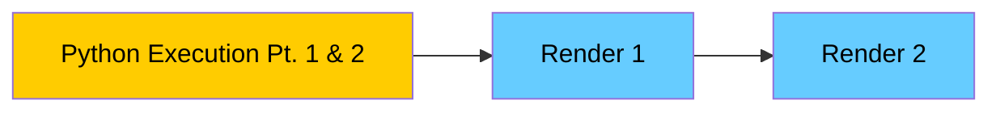
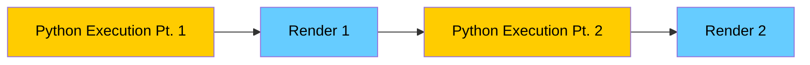

---
# try also 'default' to start simple
theme: bricks
# random image from a curated Unsplash collection by Anthony
# like them? see https://unsplash.com/collections/94734566/slidev
background: https://source.unsplash.com/collection/94734566/1920x1080
# apply any windi css classes to the current slide
class: 'text-center'
# https://sli.dev/custom/highlighters.html
highlighter: shiki
# show line numbers in code blocks
lineNumbers: false
# persist drawings in exports and build
drawings:
  persist: false
# use UnoCSS (experimental)
wakeLock: "build"
# aspect ratio for the slides
aspectRatio: 16/9
css: unocss
---

# WebTigerPython

## edu-i-day 

Clemens Bachmann

---
layout: two-cols-header
---

# Who am I

::left::
- Clemens Bachmann
- Doctoral / Teachers Diploma Student
- clemens.bachmann@inf.ethz.ch
- Algorithms and **Didactics** Group
- Working in the Group of Dennis Komm

::right::


[Illustration by Anna Staub](https://www.instagram.com/anna.staub.illustration/?hl=en)

---
layout: wtp-2-cols
code: |
  # Koch.py

  from gturtle import *

  def koch(s, n):
      if n == 0:
          forward(s)
          return
      koch(s / 3, n - 1)
      left(45)
      koch(s / 3, n - 1)
      right(90)
      koch(s / 3, n - 1)
      left(45)
      koch(s / 3, n - 1)

  setPenColor("blue")
  speed(-1)
  setPos( -100, 100)
  for i in range(4):
      right(90)
      koch(100, 4)
---

# WebTigerPython🐯🐍 - Programming in the browser

- New Features
- Hands-on Examples
- Code skeletons
- https://linktr.ee/webtp
---
layout: two-cols-header
---

# Features of WTP 🛠️

::left::


Visual Computing (turtle, gpanel, pygame)


Robotics (WebUSB, simulation)

::right::


Databases (sqlite3, database1)


Debugger

---
layout: wtp-2-cols
code: |
  import pygame

  pygame.examples.chimp.main()
---


- Popular library for programming games
- Sounds, images, animations
- Event handling (keyboard, mouse)
- Can be used in the browser*

*asynchronity issue

---
layout: two-cols-header
---

# Asynchronity Problem

<!-- ::left::

- Render Updates are done in the Webloop
- It is not possible to synchronously give control to webloop
- asyncio.sleep
  - only in asynchronous contexts
  - async Programming is not easy

::right:: -->

::left::


::right::
### Synchronous Execution in Browser



### Desired Execution Flow



---

# Asynchronity Example

````md magic-move
```py
from pygame import *

def render():
     #...
    display.flip()

def updateActors():
    #...
    render()

def main():
    while True:
        #...
        updateActors()

main()
```
```py
from pygame import *
import asyncio

async def render():
     #...
    display.flip()
    await asyncio.sleep(0)(0)

def updateActors():
    #...
    render()

def main():
    while True:
        #...
        updateActors()

main()
```
```py
from pygame import *
import asyncio

async def render():
     #...
    display.flip()
    await asyncio.sleep(0)(0)

async def updateActors():
    #...
    await render()

def main():
    while True:
        #...
        updateActors()

main()
```
```py
from pygame import *
import asyncio

async def render():
     #...
    display.flip()
    await asyncio.sleep(0)(0)

async def updateActors():
    #...
    await render()

async def main():
    while True:
        #...
        await updateActors()

await main()
```
````

---
layout: wtp-2-cols
code: |
  import sys, pygame, time

  W,H = 400, 600
  pygame.init()
  s = pygame.display.set_mode((W,H))

  # simple objects as rects
  player = pygame.Rect(W//2-15, H-50, 30, 10)
  aliens = [pygame.Rect(50 + i*60, 50, 32, 20) for i in range(5)]
  bullets = []

  # gameloop
  while True:
      for e in pygame.event.get():
          if e.type == pygame.QUIT:
              pygame.quit(); sys.exit()
          if e.type == pygame.KEYDOWN:
              if e.key == pygame.K_SPACE:
                  bullets.append(pygame.Rect(player.centerx-2, player.top-8, 4, 8))

      # keyboard interaction
      keys = pygame.key.get_pressed()
      if keys[pygame.K_LEFT]:
          player.x -= 4
      if keys[pygame.K_RIGHT]:
          player.x += 4
      player.x = max(0, min(W-player.w, player.x))

      # TODO move bullets and simple collision
      # use x.colliderect(y) to check if there is a collision


      # draw
      s.fill((0,0,0))
      pygame.draw.rect(s, (0,200,255), player)
      for a in aliens: pygame.draw.rect(s, (200,50,50), a)
      for b in bullets: pygame.draw.rect(s, (255,255,0), b)
      pygame.display.flip()
      time.sleep(0.006)
---

# Pygame - Hands on

- Check out the code example
- Try to implement bullet movement
- Implement simple collision detection
  - use x.colliderect(y) to check if there is a collision
- Implement alien movement
- Have fun!
- [linktr.ee/webtp](https://linktr.ee/webtp)

---
layout: wtp-2-cols
code: |
    import pygame
    pygame.examples.aliens.main()
---
# Pygame Aliens Example
---
layout: two-cols-header
---

# Maqueen Plus V3 Lidar

::left::


::right::


---
layout: wtp-2-cols
code: |
    from mbrobot_plusV3 import * 

    setSpeed(100)

    repeat:
        # Very fast
        f1 = getDistanceAt(0,0)
        # Rather slow
        grid = getDistanceGrid()
        print(f1,grid)
        delay(1000)
device: micro:bit
---

## Maqueen Plus V3 Lidar - Hands on

- Get a micro:bit Maqueen Plus V3 Robot
- Get a micro:bit
- Screw the lidar sensor on top
- Exercise: Follow the Wall
    - getDistanceGrid() - gets the distance grid (slow)
    - getDistanceAt(x,y) - gets the distance at a specific coordinate (fast)
    - forward(), left(), right(), leftArc(radius), rightArc(radius)

- [Solution](https://webtigerpython.ethz.ch/#?code=NobwRAdghgtgpmAXGGUCWEB0AHAnmAGjABMoAXKJMAMwCcB7GAAhgCMHX6yB9bAGwCuAZwBqAZiZoY2erTJMAVEwA6EVULhkAytjhxiACgCMABhMBKVatpxd5RKqZOm1I0wC8TAOaaAImiEKCABjOABBMgMAFgILR2dqACYPbz8AoNCIgzECMUs1CGcmbFoMSNcCJPz4pzRqFzcAPiYxE0QiopqOvjhqMjDaYIMTTCj8org-OpdkgB4mRLauotKvAAtI8edJjQdCjqdqWQB3KFpDLadiSahcYzMLMABfAF0gA&device=micro%3Abit&playground=N4IgygLghgThBCB7AHiAXAbQGwCYAcAdFsQOwAsAzFgIxYAMAnGQKwA0We1BDWFzFJEswY5%2BbOgF1WIeABtEAYwDWiAEYArAKYKIAZ3QYMtStxzUcdamUtkcg1tWoUGBPjTp0OTz6wBmUWV1NVkkpEAB1APkNbT0DbCdWfjJWOzpWMikMMjx0hhJ0vD5UrLw8EgdnFJIeEKzzIQdzLCTqPHZ63BxWPCwKknM61gwRClYa9LIGMZxSihTmHBSrBgyJMIAHWSgATwBzGEQAVwA7ABMwAEsAL00DCw9Uj0kAXyA) 

<!-- <v-clicks>

- Compact educational microcontroller
- Python programmable
- Built-in sensors
  - Accelerometer
  - Temperature
  - Compass

</v-clicks> -->

---
layout: wtp-2-cols
code: |
    from mbrobot_plusV3 import * 

    setSpeed(100)
    repeat:
        l = not irLeft.read_digital()
        r = not irRight.read_digital()
        m = not irM.read_digital()
        if m:
            forward()
        elif l:
            print("right")
            leftArc(0.1)
        elif r:
            rightArc(0.1)
        else:
            left()
        x = intersectionDetecting()
        ## Exercise 1:
        # Turm on type 2
        #  four Way: 1
        #  T: 2
        #  |-: 3
        #  -| : 4
        # Exercise 2:
        # go left on four way intersection

---

# Robotics with Micro:bit - Intersections

- Does not work in the simulator
- Code skeleton follows the line
- Exercise 1:
    Turn on type 2 intersection
- Exercise 2:
    Go left on four way intersection

---

# Survey

---

# WebTigerPython - The Future 🚀

- Improve simulator
- Multifile projects
- Git / OneDrive integration
- More libraries
- Feedback
- Thank you
